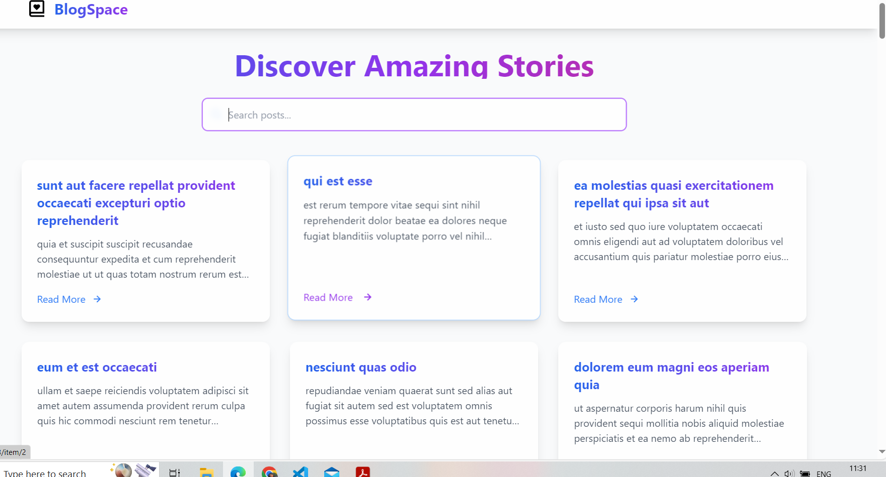

# 📚 Advanced React.js Application

Welcome to the **Advanced React.js Application**! This project is a simple yet powerful application that fetches and displays posts from the JSONPlaceholder API. Users can search for posts, view details, and enjoy a smooth, interactive experience with animations and a colorful design.

## 🚀 Features

- **Fetch Data**: Retrieves a list of posts from the JSONPlaceholder API.
- **Search and Filter**: Users can search for posts by title.
- **Responsive Design**: Built with Tailwind CSS for a modern and responsive UI.
- **Routing**: Implemented using `react-router-dom` for navigation between pages.
- **Animations**: Smooth animations using Framer Motion for a better user experience.

## 📦 Technologies Used

- **React**: A JavaScript library for building user interfaces.
- **Vite**: A fast build tool for modern web projects.
- **Tailwind CSS**: A utility-first CSS framework for styling.
- **Axios**: A promise-based HTTP client for making API requests.
- **Framer Motion**: A library for animations in React.

## 🛠️ Installation

To get started with this project, follow these steps:

1. **Clone the repository**:

   git clone https://github.com/yourusername/advanced-react-app.git
   cd advanced-react-app

   Install dependencies:
   npm install

   Run the application:
   npm run dev

   Open your browser and navigate to http://localhost:5173 to see the application in action!

🔗 API Used
JSONPlaceholder: A free fake API for testing and prototyping. JSONPlaceholder API

📄 License
This project is licensed under the MIT License - see the LICENSE file for details.

🤝 Contributing
Contributions are welcome! If you have suggestions for improvements or features, feel free to open an issue or submit a pull request.

Thank you for checking out this project! Enjoy exploring the application! 🎉

